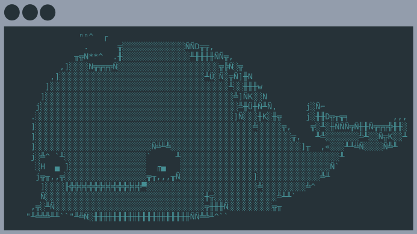

# `monoctl`

`monoctl` implements the cli for Monoskope.

## Documentation

### Getting started

* Build executable with: `make go-build-monoctl`. This will build an executable with your architecture. Rename the one for your system to `monoctl`
* Set up configuration: `./monoctl config init -u api.monoskope.your.domain:443`

The creation of the configuration will also trigger an authentication with the Gitlab OpenID provider used by Monoskope. If you have a valid session in your browser this will be re-used.

`monoctl` also uses the keyring integration with the [`zalando/go-keyring`](https://github.com/zalando/go-keyring) library. When starting `monoctl` this may result in a dialog box appearing, that requests your password.

### General

* Docs on the almighty [Makefile](docs/Makefile.md)
